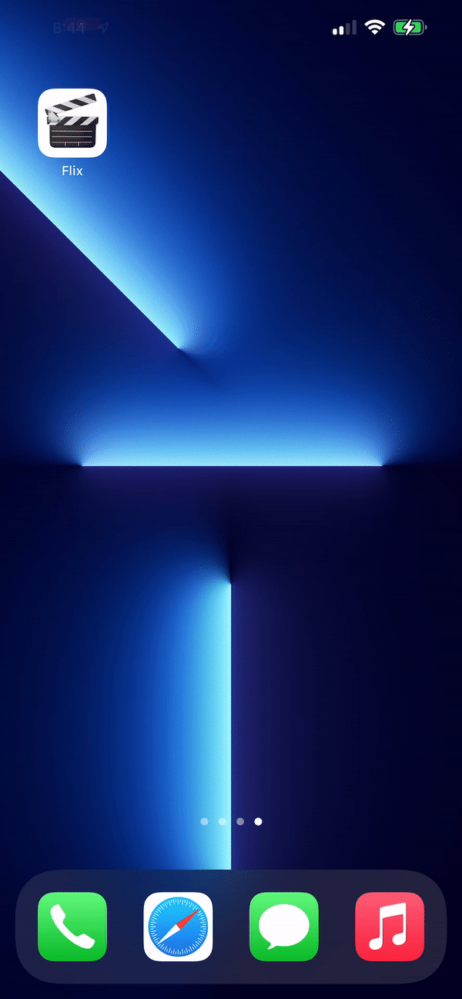
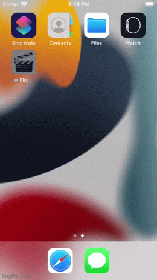
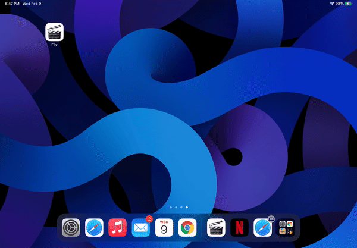

# Flix

Flix is an app that allows users to browse movies from the [The Movie Database API](http://docs.themoviedb.apiary.io/#).

---

## Flix Part 2

### User Stories

- [✅] User can tap a cell to see more details about a particular movie.
- [✅] User can tap a tab bar button to view a grid layout of Movie Posters using a CollectionView.
- [✅] User can tap a poster in the collection view to see a detail screen of that movie.

### App Walkthrough GIF
iPhone 13 Pro Max (Personal Device)

 

iPhone SE (Simulator)

 

iPad Air (Personal Device)

 

### Notes
- ~~Working on changing the superhero screen to a genres screen which leads to another view where movies in that genre.~~
- ~~Working on implementing a detail screen for a movie under a specific genre.~~

---

## Flix Part 1

### User Stories

- [✅] User sees an app icon on the home screen and a styled launch screen.
- [✅] User can view and scroll through a list of movies now playing in theaters.
- [✅] User can view the movie poster image for each movie.
- [✅] User can view the app on various device sizes and orientations.
- [✅] Run your app on a real device.

### App Walkthrough GIF
iPhone 13 Pro Max (Personal Device)

 

iPhone SE (Simulator)

 

iPad Air (Simulator)

 

### Notes
- ~~Working on auto-layout since I used iPhone 12 sim for the development and tried to run it on my iPhone 13 Pro Max. On my iPhone, I can see a black bar on the right side of the screen which is wasted screen real estate.~~
